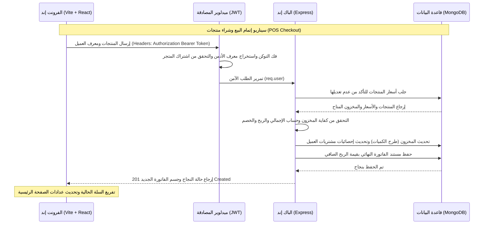

# دليل الهيكلية البرمجية والربط الفني لنظام كاشير - Kasher Project

يركز هذا الدليل على شرح تفصيلي لهيكلية المشروع بجانبيه (Frontend) و (Backend) والترابط البرمجي بينهما. يُعد النظام منصة متعددة المستأجرين (Multi-tenant POS) لإدارة نقاط البيع والمتاجر والسوبرماركت.

---

## 1. الهيكل العام للمشروع (Project Structure)

ينقسم المشروع إلى مستودعين برمجيين رئيسيين:
1. **واجهة المستخدم (Front-end)**: مطورة بلغة **TypeScript** وإطار عمل **React** وأداة البناء **Vite**.
2. **الخادم وقاعدة البيانات (Back-end)**: مطور بـ **Node.js** وإطار عمل **Express** مع قاعدة بيانات **MongoDB** بواسطة **Mongoose**.

---

## 2. هيكلية واجهة المستخدم (Front-end Architecture)

مساحة العمل تقع في الفولدر `d:\kasher-frontend`.

### 📂 شجرة المجلدات الأساسية:
- `client/src/components/ui/`: المكونات الأساسية المشتركة مثل الأزرار والمدخلات (`button.tsx`, `input.tsx`, `dialog.tsx`).
- `client/src/contexts/`: سياقات الحالة المشتركة وعلى رأسها سياق التحقق من الهوية والأذونات [AuthContext.tsx](file:///d:/kasher-frontend/client/src/contexts/AuthContext.tsx).
- `client/src/lib/`:
  - `api.ts`: إعداد برنامج العميل لإرسال طلبات الـ HTTP وإدارة الـ Headers والتوكينز تلقائياً.
  - `adminApi.ts`: يحتوي على كافة استدعاءات API الخاصة بلوحة تحكم الأدمن (الفواتير، العملاء، التقارير).
- `client/src/pages/`: صفحات النظام الرئيسية مثل:
  - `Login.tsx` & `Register.tsx`: تسجيل الدخول والاشتراك للشركات والمتاجر الجديدة.
  - `Home.tsx`: لوحة القيادة ومؤشرات الأداء البياني وسرعة دوران السلع.
  - `AdminSection.tsx`: عصب الفرونت إند، حيث يدير كافة الأقسام التفاعلية (نقطة البيع POS، إدارة المنتجات، الفواتير، العملاء، والتحليلات).

---

### 💻 كيفية عمل المكونات التفاعلية (Front-end Interaction Flow):

#### 🛒 شاشة نقطة البيع (POS View):
- يقوم الكاشير بالبحث عن المنتجات بالاسم أو كود الـ SKU. يتم فلترة المنتجات لحظياً من مصفوفة الحالة المحلية.
- **اختيار العميل (Searchable Dropdown)**: تم تطوير قائمة اختيار تفاعلية منسدلة. بمجرد النقر، تظهر خانة بحث داخل القائمة لتصفية العملاء وفق الاسم أو الهاتف للوصول السريع.
- عند النقر على إتمام البيع، يقوم التابع `checkout` بإرسال طلب POST إلى `/api/admin/invoices` محملاً بمعرّف العميل المختار وقائمة المنتجات المباعة وطريقة الدفع والخصم.

#### 🧾 شاشة استعراض وتفاصيل الفواتير (Invoices View):
- تعرض الفواتير مرتبة من الأحدث إلى الأقدم مع إمكانية البحث المتقدم بالتواريخ أو المبالغ أو اسم العميل.
- **عرض التفاصيل الفورية (Live Customer Info)**: عند النقر على الفاتورة، يفتح مودال تفصيلي ويقوم بطلب API فوري لجلب بيانات العميل الحية بواسطة معرف العميل `customerId` لإظهار تفاصيل هاتفه وعنوانه وحالته الحالية في قاعدة البيانات لضمان دقة البيانات وتكاملها.
- **التصدير الاحترافي**: يوجد زر تصدير مدمج يستخدم مكتبة `XLSX` لتصدير كامل بيانات الفواتير المعروضة إلى ملف Excel احترافي متكامل يدعم اللغة العربية.

#### 👥 شاشة إدارة العملاء (Customers View):
- تم تبسيط إضافة العميل وحذف حقل البريد الإلكتروني (Email) لتسريع الإدخال للكاشير، وتوضيح أن حقل العنوان هو حقل اختياري.
- تعرض قائمة العملاء معلومات عن معدلات الطلب والقيمة الكلية لمشتريات كل عميل.

---

## 3. هيكلية خادم الباك إند (Back-end Architecture)

مساحة العمل تقع في الفولدر `d:\casher\KasherProject`.

### 📂 شجرة المجلدات والملفات الرئيسية:
- `server.js`: نقطة الدخول الرئيسية للخادم، وربط المسارات (Route Mounts)، والاتصال بقاعدة البيانات، وتهيئة Swagger لتوثيق الـ APIs.
- `models/`: طبقة قواعد البيانات (Schemas):
  - `User.js`: بيانات المستخدمين والأدمن والشركات (Tenants).
  - `Product.js`: بيانات المنتجات والكميات المتاحة والتصنيفات.
  - `Customer.js`: بيانات العملاء وحجم مبيعاتهم.
  - `Invoice.js`: تفاصيل الفواتير والأصناف والربحية الإجمالية.
- `routes/`: تعريف المسارات وحماية الميدلوير (Auth, Subscriptions) وشروط التحقق (Validators).
- `controllers/`: منطق العمل الأساسي (Business Logic).

---

### ⚙️ منطق العمل الخلفي (Back-end Business Logic):

#### 🔐 نظام الأمان وتعدد المستأجرين (Multi-tenancy):
- يتم عزل بيانات كل متجر أو شركة عن الآخرين برمجياً.
- عند إرسال أي طلب، يمر عبر ميدلوير الحماية `authenticate` و `authorize` اللذين يقرآن توكن JWT ويسجلان بيانات المستخدم في الكائن `req.user`.
- يتم استخدام معرف الشركة `adminId` المستخلص من حساب الأدمن لتصفية كافة استعلامات قواعد البيانات للعملاء والمنتجات والفواتير (لا يرى المتجر إلا بياناته الخاصة فقط).

#### 🧾 معالج إنشاء الفاتورة الجديد (`addInvoiceController.js`):
1. **التحقق وتأمين الأسعار**:
   - لمنع أي تلاعب بالأسعار من طرف المتصفح، يرسل الفرونت إند فقط كمية البضائع و `productId`. يقوم الباك إند بجلب أسعار المنتجات الأصلية وأسعار البيع مباشرة من قاعدة البيانات.
2. **إنشاء كود الفاتورة تلقائياً**:
   - يتم إنشاء رقم كود فاتورة تسلسلي مميز وتلقائي مثل `INV-1786894828626`.
3. **تخصيص بيانات العميل**:
   - يتم التحقق من وجود `customerId`؛ وإذا وجد، يجلب الباك إند اسمه ورقم جواله الفعلي من قاعدة بيانات العملاء ويسجلها بداخل مستند الفاتورة لتجنب الفراغات، وفي حال عدم وجوده تسجل الفاتورة كـ `"عميل نقدي"`.
4. **تعديل المخازن لحظياً**:
   - لكل صنف مبيع، يتم تعديل المخزون مباشرة بطرح الكمية المبيعة (`$inc: { quantity: -item.quantity }`).
5. **تحديث إحصائيات العملاء**:
   - إذا تم تحديد عميل، يتم تلقائياً زيادة عدد طلباته وقيمة مشترياته الكلية وتحديث تاريخ آخر طلب له في جدول العملاء.

#### 🔍 محرك البحث الذكي عن الفواتير (`searchInvoicesController.js`):
- يربط عمليات البحث المتقدمة بالحقول الحقيقية لقاعدة البيانات. تم إصلاح الخلل الفني وربطه بحقول `customer.name` و `totalAmount` و `createdAt` مع تصفيتها حسب المتجر لتجنب تداخل البيانات.

---

## 4. كيفية الترابط والتواصل بين الفرونت إند والباك إند

يتواصل الطرفان عبر بروتوكول HTTP الآمن من خلال طلبات RESTful API:



### 📋 بروتوكول الاتصال (API Endpoints Used):
- **إنشاء الفاتورة**: `POST /api/admin/invoices`
- **جلب الفواتير**: `GET /api/admin/invoices`
- **البحث في الفواتير**: `GET /api/admin/invoices/search`
- **جلب بيانات عميل بالـ ID**: `GET /api/admin/customers/:id`
- **جلب وإضافة العملاء**: `GET & POST /api/admin/customers`
- **بحث وجلب المنتجات**: `GET /api/admin/products/search`

---

## 4.2. تفاصيل تشغيل وعمل صفحة المنتجات (Products Management)

تدير هذه الصفحة إضافة وتحديث المنتجات والأقسام المرتبطة بها لترتيب المخزون.

### 🎨 الفرونت إند (Front-end):
- **المكون المسئول**: المكون `ProductsContent` في [AdminSection.tsx](file:///d:/kasher-frontend/client/src/pages/AdminSection.tsx).
- **المدخلات والميزات**:
  - حقول الإدخال الأساسية: اسم المنتج، رمز الباركود (SKU)، سعر الشراء، سعر البيع، والكمية المتوفرة في المخزن.
  - **إدارة الأقسام (Categories)**: يتيح النظام اختيار القسم المناسب للمنتج، مع إمكانية إضافة أقسام جديدة أو حذف الأقسام القديمة من نافذة منبثقة تفاعلية مباشرة.
  - **تعديل المنتجات**: عند النقر على خيار تعديل منتج، يفتح مودال (Dialog) يستدعي التابع `updateProduct` لتحديث البيانات بشكل فوري دون الحاجة لإعادة تحميل الصفحة.
- **التواصل مع السيرفر**: يتم استدعاء الدوال `createProduct`, `listProducts`, `updateProduct`, `deleteProduct` من مكتبة `adminApi.ts`.

### ⚙️ الباك إند (Back-end):
- **المسار**: `/api/admin/products` (تم تعريفه وتأمينه بداخل `routes/admin.js`).
- **قواعد البيانات (Mongoose Schema)**:
  - يُلزم الباك إند وجود حقل الباركود `sku` و `name` و `sellingPrice` و `quantity`.
  - المخطط مفهرس بفريد مركب لمنع تكرار الـ SKU لنفس المتجر: `productSchema.index({ adminId: 1, sku: 1 }, { unique: true })`.
- **معالجة البيانات (Controllers)**:
  - يتم التحقق من أن سعر البيع لا يقل عن سعر الشراء منعاً لوجود خسائر في التسعير.
  - يتم فحص فرادة الباركود (SKU) فقبل الحفظ؛ إذا تم تكراره يرجع الخادم استجابة `400` برسالة `"رمز الباركود SKU مستخدم بالفعل للمتجر"`.

---

## 4.3. تفاصيل تشغيل وعمل صفحة نقطة البيع (POS System)

تعتبر صفحة نقطة البيع هي الواجهة الأكثر استخداماً، وصممت لتكون سريعة وسهلة الاستخدام وتفاعلية بالكامل.

### 🎨 الفرونت إند (Front-end):
- **المكون المسئول**: المكون `PosContent` في [AdminSection.tsx](file:///d:/kasher-frontend/client/src/pages/AdminSection.tsx).
- **آلية العمل وسلوك السلة (Cart Operations)**:
  - **البحث الفوري**: فلترة مباشرة للسلع بكتابة الباركود (الـ SKU) أو جزء من الاسم.
  - **حالة السلة التفاعلية**: إمكانية تعديل كمية المنتج بالسلة عبر أزرار سريعة للزيادة والجموح للحد الأقصى أو الطرح للحذف، أو عن طريق حقل إدخال نصي للكمية.
  - **التحقق من المخزون بالواجهة**: لا يسمح الكود الفرونت إند بزيادة كمية السلعة بداخل السلة عن الكمية الكلية المتاحة في المخزن الفعلي للسلعة، ويظهر تحذير للمستخدم منعاً للأخطاء البيعية.
  - **إشارة كمية المخزن**: المنتجات ذات المخزون الضعيف (الكمية <= 3) تظهر بإشارة تحذيرية باللون الأحمر للتنبيه، والمنتجات النافدة يتم تعطيل نقرها.
  - **نظام حساب الخصومات**:
    - يدعم خصم مالي ثابت (مثال: خصم 20 ريال).
    - يدعم خصم نسبة مئوية (مثال: خصم 10% من المجموع الكلي).
    - يتم احتساب المجموع النهائي لحظياً في سياق العرض.
  - **اختيار العميل الذكي (Combobox)**: قائمة منسدلة مخصصة تحتوي على خانة بحث مدمجة للبحث بالاسم أو الهاتف لتسهيل ربط الفاتورة بالعميل.

### ⚙️ الباك إند (Back-end):
- **المسار**: `/api/admin/invoices` (مسار مMount في ملف خادم الباك إند الرئيسي).
- **المنطق الخلفي وقواعد الأمان (Transaction Handling)**:
  - **الحماية ضد التلاعب بالفرونت إند**: لا يثق الباك إند بالأسعار المرسلة من العميل. يقوم المخدم بعمل حلقة تكرار على الأصناف المباعة ويجلب سعر البيع (`sellingPrice`) وسعر الشراء (`originalPrice`) الحقيقي والآمن مباشرة من قاعدة البيانات.
  - **فحص المخزون الفعلي**: يتحقق الباك إند للمرة الثانية من توفر الكميات بقاعدة البيانات؛ وفي حال عدم توفرها يرفض المعاملة ويصدر رسالة خطأ.
  - **تعديل المخازن والتحديث التلقائي**: يتم استدعاء أمر التعديل الجماعي `$inc: { quantity: -item.quantity }` للمنتجات لتحديث المخازن فورياً.
  - **تسجيل الأرباح**: يتم احتساب الربح الصافي لكل منتج بالفاتورة وتخزينه في حقل `profit` لتوفير إحصائيات دقيقة في لوحة التقارير.
  - **تحديث العميل**: يتم تحديث عدد طلبات العميل وإجمالي المشتريات وتاريخ آخر طلب له بقاعدة البيانات.

---

## 5. تعليمات التشغيل والبناء (Build & Run Instructions)

### تشغيل الفرونت إند محلياً (Front-end Dev):
```bash
cd d:\kasher-frontend
pnpm install
pnpm run dev
```

### تشغيل الباك إند محلياً (Back-end Dev):
```bash
cd d:\casher\KasherProject
npm install
npm run dev
```

### البناء والإنتاج (Production Build):
للتأكد من مطابقة الكود للمواصفات والتحقق البرمجي التام وخلو المشروع من مشاكل التايب سكربت:
```bash
cd d:\kasher-frontend
pnpm run check
pnpm run build
```
يقوم الأمر بإنشاء الكود النهائي المحسن والمضغوط داخل فولدر `dist` المخصص للرفع على منصة **Vercel** أو الخوادم السحابية.
